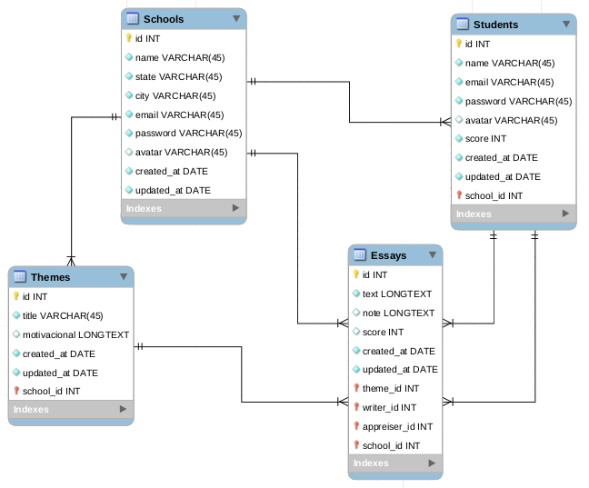

<h1 align="center">
  
  Redação UP :pencil2:
</h1>

<h2 align="center">
  A social network to practice writing ENEM (Brazilian High School Exam) standard essays
</h2>

<ul>
  <li><a href="#wrench-technologies">Technologies</a></li>
  <li><a href="#memo-license">License</a></li>
  <li><a href="#floppydisk-database-structure">Database Structure</a></li>
  <li><a href="#runner-running-locally">Running Locally</a></li>
</ul>

## :wrench: Technologies

This project was developed with the following technologies:

- [Yarn](https://yarnpkg.com/)
- [Sequelize](https://sequelize.org/)
- [ESLint](https://eslint.org/)
- [VSCode](https://code.visualstudio.com/)
- [Node.js](https://nodejs.org/en/)
- [MySQL Workbench](https://www.mysql.com/products/workbench/)
- [Nodemon](https://www.npmjs.com/package/nodemon)
- [Express](https://expressjs.com/pt-br/)
- [PostgreSQL](https://www.postgresql.org/)
- [Docker](https://www.docker.com/)

## :memo: License

This project is under the MIT license. See the [LICENSE](LICENSE) for more information.

## :floppy_disk: Database Structure



## :runner: Running Locally

Before anything, open the database.js file found in src/config, where you can change the username and password to the same ones that were configured on your computer.

After that, run the following commands in a terminal at the project root:

```sh
yarn
```

To execute the next command, it will be necessary that your database is already running properly.

```sh
yarn sequelize db:migrate
```

Now just run:

```sh
yarn dev
```

The server will be running on localhost:3333

<br/>

<p align="center">
  <a href="https://github.com/AntDavidLima/redacaoup-backend/issues"></a>
  <a href="https://github.com/AntDavidLima/redacaoup-backend/network/members"></a>
  <a href="https://github.com/AntDavidLima/redacaoup-backend/stargazers"></a>
  <a href="LICENSE"></a>
</p>

<br/>

Made with ♥ by David Lima [Come and meet me!](https://www.linkedin.com/in/antdavidlima/)
